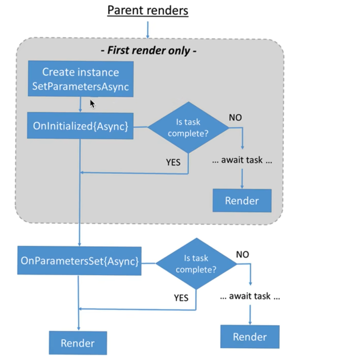

# Blazor基础

> Author: Sylvie233
>
> Date: 23/2/11
>
> Point:

[TOC]

## 基础介绍

C#代替JavaScript


Blazor Server：服务器端渲染razor组件

Blazor WebAssembly：在Web浏览器内运行.NET代码（运行类似Vue）


`.razor`、`.razor.cs`


启动顺序：`program.cs`->`_HOst.cshtml`->`_Layout.cshtml`->`App.razor`(路由)->`MainLayout.razor`


### 项目结构

```
Blazor:
	/Connected Services:
	/Properties:
		launchSettings.json:
	/wwwroot:
		/css:
		favicon.png:
	/Dependencies:
	/Data:
		WeatherForecast.cs:
		WeatherForecastService.cs:
	/Pages:
		_Host.cshtml: 主页
		_layout.cshtml:
		Index.razor:
		Counter.razor:
		Error.cshtml:
		FetchData.razor:
	/Shared:
        MainLayout.razor:
        NavMenu.razor:
        SurveyPrompt.razor:
	_Imports.razor:
	App.razor:
	appsettings.json
	Program.cs:
```


#### App.razor

路由

```
<Router 
	AppAssembly="@typeof(Program).Assmbly"
	AdditionalAssemblies
>
	<Found 
		Context="routeData"
	>
		<RouteView 
			routeData="@routeData" 
			DefaultLayout="@typeof(MainLayout)"/>
	</Found>
	<NotFound>
		<p> </p>
	</NotFound>
</Router>
```


#### MainLayout.razor

```
@inherits LayoutComponentBase

<main>
	@Body
</main>
```


#### Index.razor

```
@page "/"

<h1> Hello Sylvie~~~ </h1>
```


#### appsettings.json

```
{
	"DetailedErrors":
	"Logging":
		"LogLevel":
			"Default": "Infomation"
			"Microsoft.xxx":
}
```


## 核心内容

### razor组件

```
@page "/xxx"

@layout 布局组件

@namespace
@addTagHelper
@implements

@inherits 关联指定类 

@using 引入类;

@inject 注入类;
	NavigationManager
@attribute:

<html代码>
	@attributes:
	@bind
	@bind-Xxx: 绑定onXxxChange()/EventCallback
	@onxxx: 事件绑定code代码
	@xxx: 引用c#变量
	
	@if () {}
	@foreach () {}


// 关联 partial class类(加命名空间)
@code {
	[Parameter]
	[CascadingParameter]
	
	SetParametersAsync()
	OnInitialized()
	OnInitializedAsync()
	ShouldRender()
	OnAfterRender(bool firstRender)
	Dispose()
		StateHasChanged()
		InvokeAsync()
}
```


#### 生命周期

```
:
	BuildRenderTree():
		RenderTreeBuilder:
	ShouldRender():
	OnInitialized():
	OnInitializedAsync():
	OnParametersSet():
	OnAfterRender():
```




#### 内置组件

```
内置组件: 默认继承ComponentBase组件
	CascadingValue:
		Name:
		Value:
		IsFixed:
	ErrorBoundary:
		ChildComponent:
		ErrorContent:
	RenderFragment:
	RenderTemplate:
```


#### 模板组件

RenderFragment：页面html片段

Vue插槽

Context传参


#### 双向绑定

```
partila class {
	string Value
	EventCallback<string> ValueChanged
		HasDelegate:
		InvokeAsync():
}
```


### 路由

```
<Router>
	<RouteView>
```


@page区分页面与组件


#### NavigationManager

```
NavigationManager:
	NavigateTo():
```


### 配置


### 依赖注入

内置对象

```
内置对象:
	NavigationManager:
		
```


### 异常处理


### JavaScript

blazor中调用js代码


JSRuntime

```
JSRuntime:
	InvokeAsync:

IJSObjectReference:
	
```


## API

```

```


### WebApplication

```
WebApplication:
	CreateBuilder():
		Services:
			
```


## Blazor WebAssembly

代替Vue使用


HttpClient代替Axios作http请求


### 内置组件

```
:
	EditForm:
	InputSelect:
	InputText:
	InputTextArea:
```


