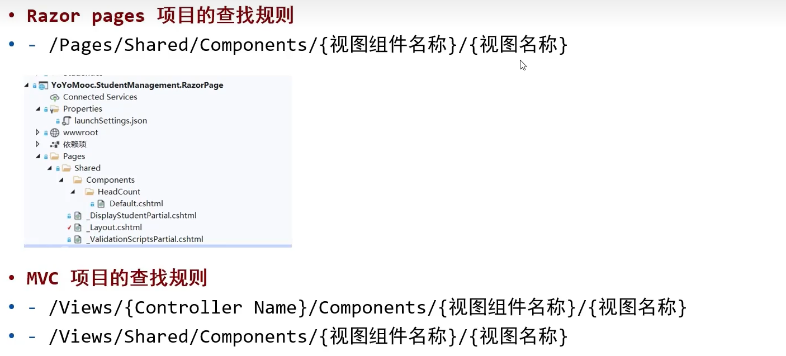

# RazorPages基础

> Author: Sylvie233
>
> Date: 23/2/12
>
> Point: P

[TOC]

## 基础介绍

### 项目目录

```
razor pages:
	/Connected Services:
	/Properties:
		/publishProfiles:
		launchSettings.json:
	/wwwroot:
		/css:
		/js:
		/lib:
		favicon.ico:
	/依赖项:
	/Pages:
		/Shared:
			_Layout.cshtml:
			_ValidationScriptsPartial.cshtml:
		_ViewImports.cshtml:
		_ViewStart.cshtml:
		Error.cshtml:
		Index.cshtml:
		Privacy.cshtml:
	appsettings.json:
	Program.cs:
	Startup.cs:
```


#### .csproj

```
<Project 
	Sdk>
	<PropertyGroup>
		<TargetFramework></TargetFramework>
		<AspNetCoreHostingModel>
			OutOfProcess
		</AspNetCoreHostingModel>
		<UserSecretsId></UserSecretsId>
	</PropertyGroup>
	
	<ItemGroup>
		<Compile Remove/>
		
		<Content Update>
			<CopyToOutputDirectory></CopyToOutputDirectory>
		</Content>
		
		<PackageReference 
			Include
			PrivateAssets
			Version
		/>
	</ItemGroup>
	
	<ProjectExtensions></ProjectExtensions>
</Project
```


#### appsettings.json

```
{
	"ConnectionStrings": {
		"Defaults":
	},
	"Logging": {
		"LogLevel": {
			"Default":
		}	
	},
	"AllowedHosts": "*"
}
```


#### _Layout.cshtml

```


@RenderBody()

@await RenderSectionAsync("Scripts", false)

```


## 核心内容

```
@using 命名空间
@namespace 命名空间
@addTagHelper *, Microsoft.AspNetCore.Mvc.TagHelpers


@page "/xxx指定路由"

@model Xxx模型类

@{
	Component:
		InvokeAsync():
	Html:
		PartialAsync():
	Model: PageModel变量使用
	TempData[]:
		Keep():
	ViewData[]:	
}

html混编:
	@xxx: 使用变量
	@* 注解 *@
	@foreach (var xxx in xxx) {}
	@if () {}
	@section xxx {}

内置组件:
	<partial>
		name:
		model:
		view-data:
	<vc:xxx>
```


### 服务注册

依赖注入


### 路由

采用Pages目录的约定式路由


路由约束


### PageModel

```
PageModel:
	OnGet():
	OnPost():
	OnPostXxx():
```


### Helper

```
asp指令:
	asp-append-version:
	asp-area:
	asp-for:
	asp-items:
	asp-page:
	asp-page-handler:
	asp-route-xxx:
	asp-validation-for:
	asp-validation-summary:
```


### 分部视图

名称以下划线`_`开头的`.cshtml`文件：实现模板复用（组件封装）


### ViewComponent

视图组件




ViewComponent

```
ViewComponent:
	Invoke():
	InvokeAsync():
```


## API(Microsoft)

### AspNetCore

```
Microsoft.AspNetCore:
	Hosting:
	Mvc:
		RazorPages:
		TagHelpers:
```


