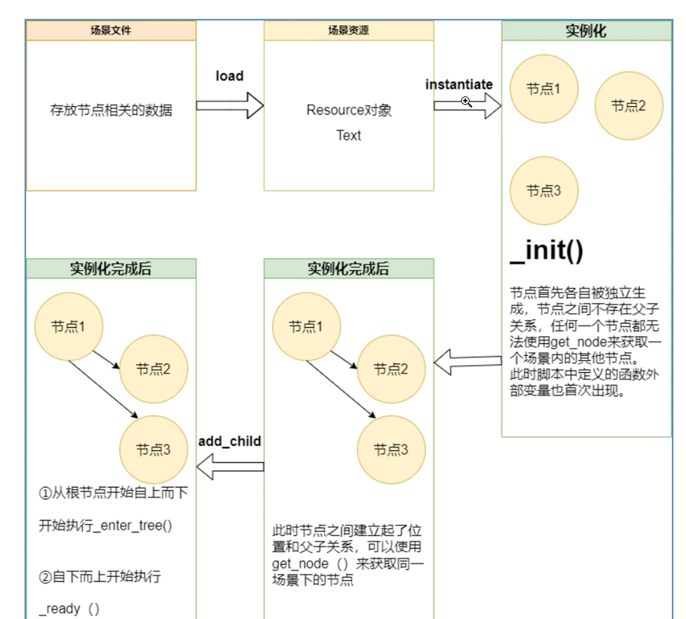

# Godot

> Author: Sylvie233
>
> Date" 23/7/14
>
> Point:

[TOC]

## 基础介绍

游戏进程，场景数与内置服务器

加载项目设置

`project.godot`、`override.cfg`


项目启动




MainLoop、SceneTree

组Group：节点统一处理


Viewport视口


远程、调试器


### Node

节点Process运行情况


CanvasItem: Node2D、Control


#### CanvasItem


##### Node2D


### 场景

`.tscn`


场景合并：场景类似组件封装了


项目设置运行主场景

```
:
	常规设置：
	键位映射：
	本地化：
	Autoload：
	ShaderGlobals：
	插件：
	默认导入设置：
```


### 信号

`signal`发送、接收信号用以处理特定事件

节点内置信号、自动发送

信号绑定函数`connect`

手动发射信号`emit_signal`

`await`等待信号

每个对象有自己的内部信号连接表


### 脚本


### 资源

`.import`文件

游戏启动后借助import文件加载特殊文件生成资源对象

`load()`、`preload()`


`.res`与`.tres`文件


#### 物理材质


### 动画


## 核心内容

### GDScript

```
:
	AnimatedSprite2D:
		play():
		stop():
	AnimationPlayer:
		play():
		stop():
	Area2D:
        vec:
        	x:
        	y:
		add_to_group():
		get_overlapping_areas():
		get_overlapping_bodies():
		is_in_group():
		overlaps_area():
		overlap_body():
		area_enter:
		on_area_enter(area):
		on_body_entered(body):
	Array:
		append():
		erase():
		size():
	AudioStreamPlayer:
		play():
	BaseButton:
		pressed:
		_on_pressed():
	BitMap:
		
	Button:
		process_mode:
		pressed:
		_on_pressed():
	Callable:
    Camera2D:
    	
    Camera3D:
    CanvasItem:
    	modulate:
    	visible:
    CharacterBody2D:
    	is_on_ceiling():
    	move_and_slide():
    CollisionObject2D:
    	collison_layer:
    	collison_mask:
    	collision_priority:
    	input_pickable:
    Container:
    	pre_sort_children:
    Control:
    	resized:
    	_gui_input(event):
    	---
    	grab_focus():
	Image:
		load():
	ImageTexture:
		create_from_image():
	Input:
		get_action_strength():
		get_axis():
		is_action_just_pressed():
	InputEvent:
		InputEventAction:
		InputEventFromWindow:
		InputEventMouseButton:
			button_index:
			pressed:
	Label:
		text:
	MainLoop:
	Node:
		_enter_tree():
		_init():
		_input():
		_unhandled_input():
		_shortcut_input():
		_unhandled_key_input():
		_ready():
		_process(delta):
		_physics_process(delta):
		---
		owner:
		position:
			x:
			y:
		add_child():
		add_sibling():
		add_to_group(): 添加进小组
		connect():
		emit_signal():	
		find_child():
		get_child():
		get_children():
		get_node(): $名称可快速获取子节点	
		get_parent():
		get_tree(): 获取场景树
			crate_timer():
				timeout:
        load(): 手动加载Resource资源
        preload():
		queue_free():
		remove_from_group():
	Object:
		_init():
		_notification(what):
		call():
		call_deffered():
		connect():
		disconnect():
		emit_signal():
		free():
		is_connect():
		set_script(script): 动态挂载脚本
	PackedScene:
		pack():
	ProjectSettings:
		get_setting():
	RayCast2D:
		get_collider():
	RefCounted: 引用计数器（相当于其它语言中的普通类）
		new():
	Resource:
		instantiate(): 实例化（返回实例后的根节点）
	ResourceSaver:
		save():
	RigidBody2D:
		
	SceneTree:
		paused():
		call_group(): 调用组内成员的指定函数
		change_scene(): 切换场景
	ShapeCast2D:
		get_collider():
	Sprite2D:
		texture:
		visible:
		hide():
		show():
	StaticBody2D:
	String:
		num():
		---
	SubViewport:
	Texture2D:
	TextureButton:
		texture_click_mask:
	Timer:
		autostart:
		start():
		stop():
		timeout:
	Transform2D:
	Vector2:
		x:
		y:
	VideoStreamPlayer:
		 
	Viewport:
		world_2d:
		push_input(): 手动触发input事件
		set_input_as_handled():
	World2D:
	World3D:
	is_equal_approx():
	print():
```


类似Python语法


#### 变量

```
var xxx : int = xxx

int|float|String|bool

var arr: Array[int] = [xxx]

const xxx: 常量


@export  xxx : 变量导出到面板中

@onready : 延迟赋值
```


#### 函数

```
func xxx() -> int:
	xxx
	
self:
```


#### 类

```
class_name xxx: 定义类名

extends xxx : 继承(可填路径res://x/gd)

var xxx : 定义成员

super(): 调用父类
```


Object基类	


#### 流程控制

```
if (): elif(): else:

while():

for in:
```


#### 单例


#### 信号

`signal`


### 插件

```
@tool
extends EditorPlugin

func _enter_tree():
func _exit_tree():
```


## API

```
Node:
	AnimationPlayer:
	AnimationTree:
	AudioStreamPlayer:
	CanvasItem:
		Visibility:
		Ordering:
		Texture:
		Material:
		---
		Control:
			Layout:
			Localization:
			Tooltip:
			Focus:
			Mouse:
			Input:
			Theme:
			---
			BaseButton:
				Button:
					CheckButton:
					ColorPickerButton:
					MenuButton:
					OptionButton:
				LinkButton:
				TextureButton:
			ColorRect:
			Container:
				BoxContainer:
					ColorPicker:
					HBoxContainer:
					VBoxContainer:
				CenterContainer:
				FlowContainer:
				GridContainer:
				SplitContainer:
				MarginContainer:
				PanelContainer:
				ScrollContainer:
				SubViewportContainer:
			GraphEdit:
			ItemList:
			Label:
			LineEdit:
			MenuBar:
			NinePatchRect:
			Range:
				SpinBox:
				TextureProgressBar:
			RichTextLabel:
			Separator:
			TextEdit:
				CodeEdit:
			TextureRect:
			VideoStreamPlayer:
		Node2D:
			Bone2D:
			Camera2D:
			CollisionObject2D: 碰撞体
				Collision:
					Layer:
					MasK:
				---
				Area2D: 
				PhysicsBody2D:
					RigidBody2D:
					StaticBody2D:
					CharacterBody2D:
			CollisioniPolygon2D:
			CollisionShape2D:
			CPUParticles2D:
			Light2D:
			RayCast2D: 射线
			ShapeCast2D: 形状射线
			Sprite2D:
			TileMap:
			AnimatedSprite2D:
			AudioListener2D:
			AudioStreamPlayer2D:
	CanvasLayer:
		
	HTTPRequest:
	MultiplayerSpawner:
	NavigationAgent2D:
	NavigationAgent3D:
	NavigationObstacle2D:
	Node3D:
		CollisionObject3D:
			Area3D:
		AudioStreamPlayer3D:
		RayCast3D:
		VisualInstance3D:
			GPUParticlesAttractor3D:
				GPUParticlesAttractorBox3D:
	Timer:
		
	ViewPort:
		SubViewPort:
		Window:

Resource:
	Animation:
	AnimationLibrary:
	AnimationNode:
	AudioBusLayout:
	AudioEffect:
	AudioStream:
	BitMap:
	Mesh:
	Occluder3D:
		ArrayOccuder3D:
	Texture:
	
	
```


